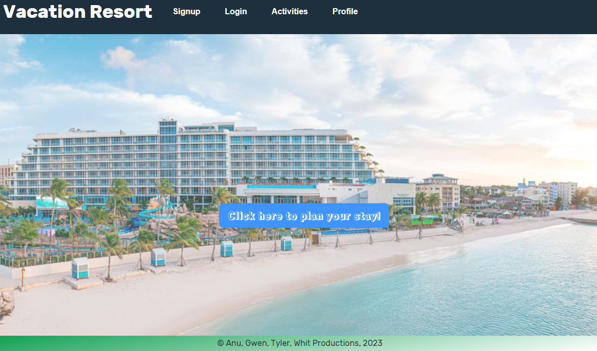

# Vacation Planner
 
 ## Description:
Full stack application utilizing a ReactJS front end, Bootstrap CSS framework, MongoDB database, Apollo Server with GraphQL routing, with CREATE USER and LOGIN features.
  
## Installation:
The deployed webpage can be viewed at the following link: https://safe-inlet-96324.herokuapp.com/

  
## Usage:
When a user accesses this webpage, they see a Welcome Message followed by a prompt to login. The user may access the login form by clicking the button at the center of the homepage, 
clicking the "Signup" tab to create a new user, or by clicking the "Login" tab directly. If the user does not log in, the user will receive an alert to log in when the user attempts to add activities to their itinerary. The activities can be viewed regardless of login status. When logged in, if the user clicks the button to "save activity to itinerary", they will receive a prompt to view their profile to view itinerary. When the user views their profile, they will see the name associated with their Signin, the email associated with their Signin, and the activities selected from the activities page. If desired, the user may click the "delete activity" button to remove the selected activities from their itinerary. This information persists without alterations even if the user logs out and logs back in to the web page. At this time, the web page is set up as a demonstration and the activities are not actively updated, so even if activities are dated are in the past, they will persist on the webpage.
  
 ## Contributors:
Anu Khadka: anuragi.khadka@gmail.com
Gwen Paradis: gwendelynparadis2@gmail.com
Tyler Powers: tylerpowerst@aol.com
Whit Spaulding: whitspa64@duck.com
     
## License
  [![License: MIT]](https://opensource.org/licenses/MIT)

© 2023
